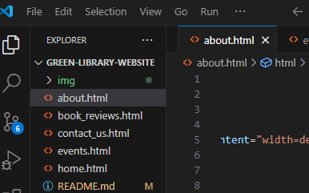
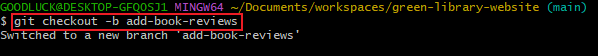
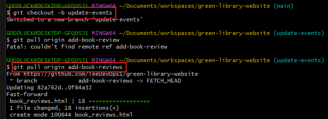
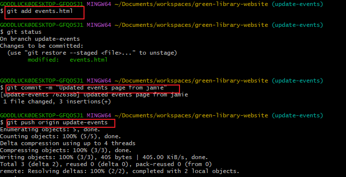

## Capstone Project: Enhancing Community Library Website

### Background Scenerio
My team is tasked with enhancing the website for s community library. The website has the following pages: Home, About_us, Events and Contact_us. 
We are tasked to add Book Reviews sections and also update the events page.

This task was completed following the steps below.

1. Create a Repository on Github (green-library-website)

2. Initialize the Readme file 

3. Clone the Repository to your local machine.

From the main branch, add the following files for the website pages:
* home.html
* About_us.html
* Events.html
* Contact_us.html

### Adding Book Reviews
Simulate a teammate's work (Morgan)
1. Create a branch for Morgan
2. Switch to a new branch named add-book-reviews

3. Add a new file Book_reviews.html section.

4. Add a random text content inside the file.

5. Stage and Commit book reviews section
 

6. push the changes to the repository.

7. Raise a pull request for Morgan's book-reviews-section and merge it to the main branch.

## Updating Events Page
Simulating a Teammate's work (Jamie):

1. Create a branch for Jamie and pulled the latest changes from the main branch into update-events.

2. Update the events page and add some new contents using vscode.

3. Stage, commit and pushed the changes to Github

4. Raise a PR for Jamie's Update-Events and merge it to the main branch.

